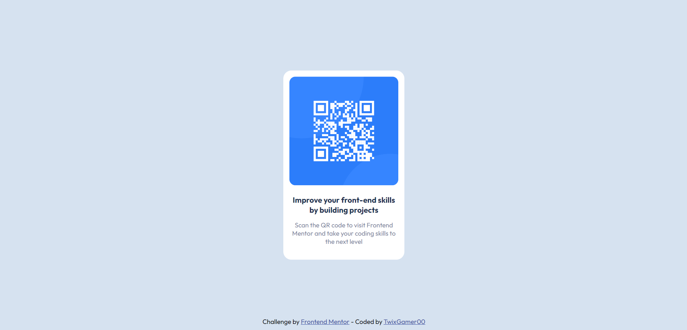

# Frontend Mentor - QR code component solution

This is a solution to the [QR code component challenge on Frontend Mentor](https://www.frontendmentor.io/challenges/qr-code-component-iux_sIO_H). Frontend Mentor challenges help you improve your coding skills by building realistic projects.

- [Screenshots](#screenshot)
- [Links](#links)
- [Author](#author)

### Screenshots

### Links

- Preview: [TwixGamer00.github.io/FrontendMentor/QR-Code/](https://twixgamer00.github.io/FrontendMentor/QR-Code/)

## Author

- Website - [TwixGamer00.github.io](https://twixgamer00.github.io/)
- Frontend Mentor - [@TwixGamer00](https://www.frontendmentor.io/profile/TwixGamer00)
